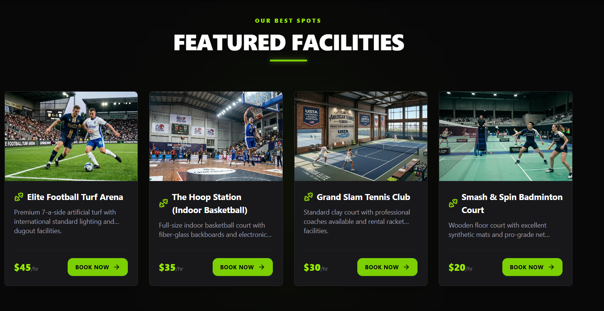

<div align="center">

# 🏆 SPORTNEST
### *Arena Live Booking System*

**Book your elite sports facilities — anytime, anywhere.**

[](https://nextjs.org)
[](https://mongodb.com)
[](https://better-auth.com)
[](https://daisyui.com)
[](https://tailwindcss.com)
---
</div>

<!-- ## 📸 Preview

|        Hero Section        |          Featured Facilities           |
| :------------------------: | :------------------------------------: |
|  |  | --> |

> *Book your slot at elite football turfs, badminton courts, basketball arenas, swimming lanes & more.*

<!-- --- -->

## 🎯 Purpose

**SportNest** is a full-stack sports facility reservation portal that allows users to explore, filter, and book professional-grade sports venues for specific dates and time slots. Designed to reflect a real-world sports booking experience — secure, fast, and intuitive.

Whether you're booking a FIFA-grade football turf for a weekend tournament or reserving a swimming lane for your morning routine, SportNest makes it seamless.

---

## ✨ Features

### 🏟️ Facility Management
- Browse all available sports facilities (Football, Basketball, Badminton, Swimming, Tennis & more)
- Detailed facility pages with images, capacity, price/hr, available slots & description
- Filter facilities by sport type
- Add new facilities via owner dashboard

### 📅 Booking System
- Real-time slot booking with date & time selection
- Email & name auto-filled from authenticated session — **tamper-proof**
- Booking confirmation screen with redirect to dashboard
- Cancel bookings from personal dashboard

### 🔐 Authentication & Security
- Secure login & registration via **Better Auth**
- Session-based user identification 
- Route protection with Next.js middleware
- Only logged-in users can book

### 👤 User Dashboard
- Personal **My Bookings** page — shows only the logged-in user's reservations
- Booking cards with facility image, date, selected slot & price paid
- One-click slot cancellation

### 📱 Responsive Design
- Fully responsive across mobile, tablet & desktop
- Dark-themed UI with lime green accents
- Smooth animations and interactive hover states

---

## 🛠️ Tech Stack

### Frontend
| Technology                  | Purpose                          |
| --------------------------- | -------------------------------- |
| **Next.js 15** (App Router) | Core framework                   |
| **Tailwind CSS**            | Styling & responsive design      |
| **Better Auth**             | Authentication (client + server) |
| **lucide-react**            | Icon library                     |
| **react-icons**             | Additional icon sets             |
| **motion** (Framer Motion)  | Animations & transitions         |

### Backend
| Technology        | Purpose                          |
| ----------------- | -------------------------------- |
| **Express.js**    | REST API server                  |
| **MongoDB Atlas** | Database (facilities + bookings) |
| **Node.js**       | Runtime                          |
| **dotenv**        | Environment config               |
| **cors**          | Cross-origin requests            |

---

## 📦 NPM Packages Used

```bash
# Frontend
npm install lucide-react        # Icon components
npm install react-icons         # Extended icon library  
npm install motion              # Animation library 

# Backend
npm install express             # Web server framework
npm install mongodb             # MongoDB driver
npm install dotenv              # Environment variables
npm install cors                # CORS middleware
```

---

## 🚀 Getting Started

### Prerequisites
- Node.js `v18+`
- MongoDB Atlas account

### Frontend Setup
```bash
cd frontend
npm install
```
```bash
npm run dev
```

### Backend Setup
```bash
cd backend
npm install
```
```bash
node index.js
```

---
<!-- ## ⚽ Live URL

> 🔗 **[https://](https://)** -->

---

## 👨‍💻 Author

<div align="center">

Built with ⚡ and 🏆 by **[Nuruddin Jewel](https://github.com/NuruddinJewel)**

[](https://github.com/NuruddinJewel)

</div>

---